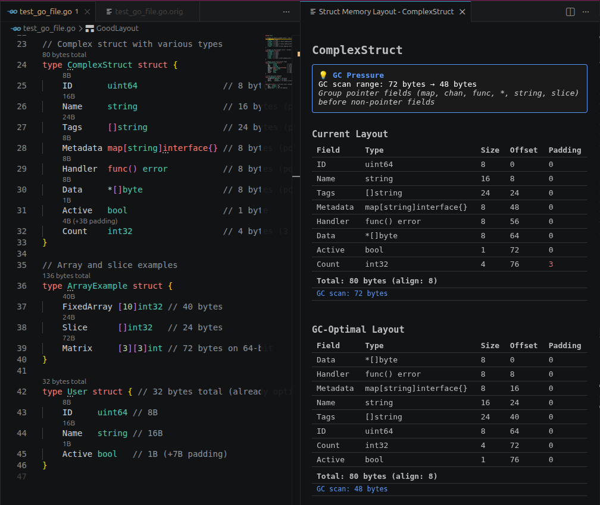

# Analyze Struct Layout Panel

The Analyze Struct Layout panel provides a detailed, side-by-side view of struct memory layouts.

## Opening

- Click the code lens annotation above any struct name
- Run **Go Struct: Analyze Struct Layout** from the Command Palette (`Ctrl+Shift+P` / `Cmd+Shift+P`)

## Layout

The panel shows up to three columns:

| Column | Description |
| - | - |
| **Current** | Actual memory layout of the struct as written |
| **Size-Optimal** | Minimal total size layout (sorted by alignment descending) |
| **GC-Optimal** | Minimal GC scan range layout (pointer fields grouped first) |

Each column shows:

- Field names with byte offsets
- Padding bytes (grayed)
- Total size footer
- GC scan range footer (e.g. "GC scan: 40 bytes")

