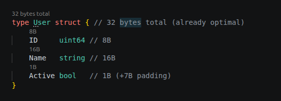

# Inline Annotations

Code lens annotations show struct and field size information directly in the editor.

## Struct annotations

A line above each struct shows total size and optimization status:

```
Event  40 bytes total (can be 24 bytes)
```

When GC pressure optimization applies, it includes GC scan info:

```
ComplexStruct  48 bytes total · GC scan 72→48B
```

## Field annotations

Inline annotations next to each field show individual sizes:

```go
type MyStruct struct {
    A bool     // 1 byte, offset 0
    B int64    // 8 bytes, offset 8 (+7 padding)
}
```



## Toggle

Annotations can be disabled via the setting `goStructAnalyzer.showInlineAnnotations`.
