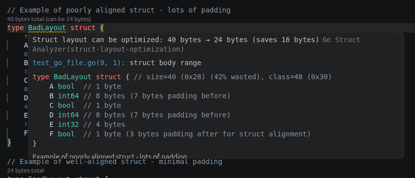
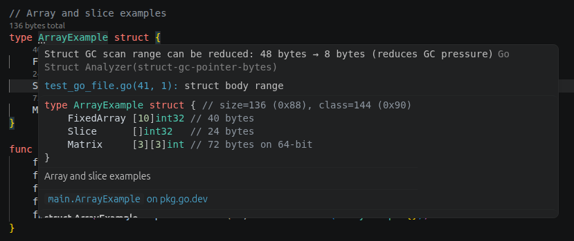

# Hover Information

Hover over any struct field or struct name to see detailed size information.

## Field hover

Hovering over a field shows:

- **Size** — bytes this field occupies
- **Alignment** — natural alignment boundary
- **Offset** — byte position relative to struct start
- **Padding** — bytes skipped before this field to satisfy alignment

## Struct hover

Hovering over a struct name shows:

- **Total size** — combined size including trailing padding
- **Alignment** — largest alignment of any field
- **Fields** — list with type, offset, and size per field

