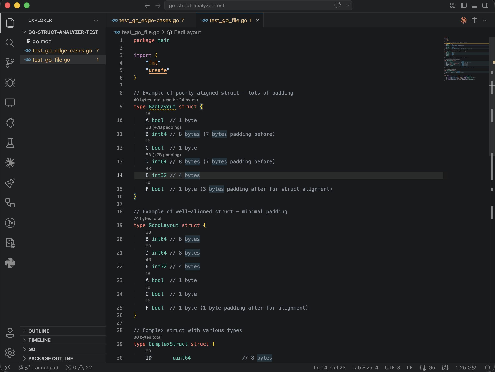
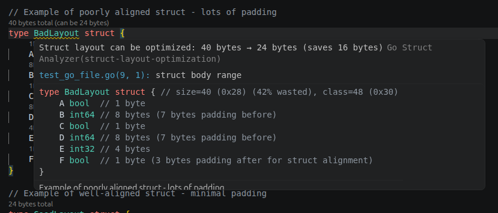
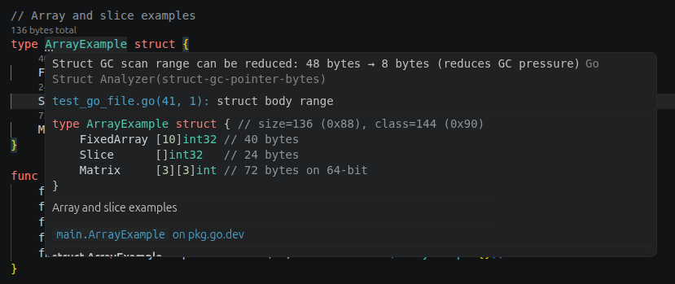
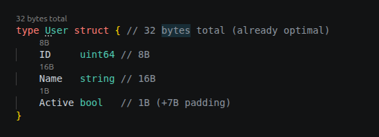
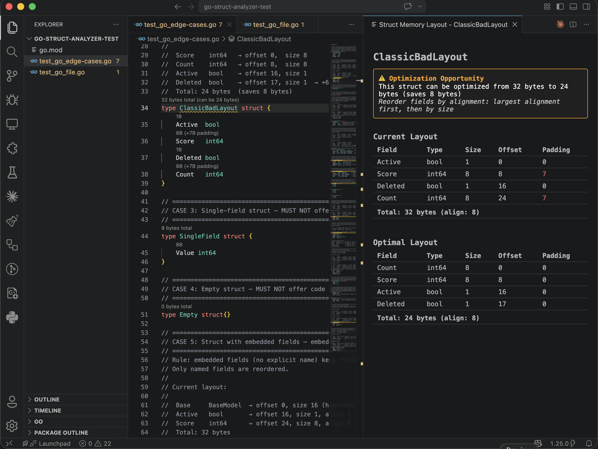
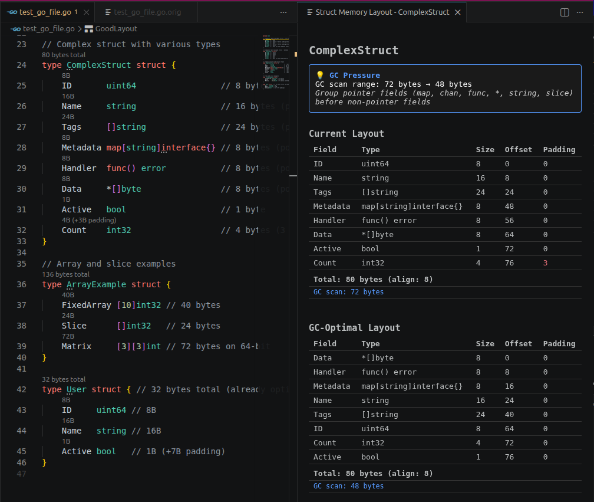
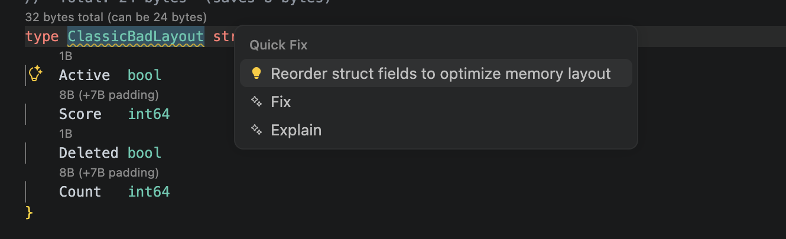

# Go Struct Analyzer

A VS Code extension that shows memory size and padding information for Go structs, helping you optimize memory usage and understand struct layout.


## Features

- **Hover Information**: Hover over struct fields to see size, alignment, offset, and padding details
- **Inline Annotations**: Code lens showing field sizes, padding, and GC scan info directly in your editor
- **Memory Layout Visualization**: Detailed struct memory layout with side-by-side Current, Size-Optimal, and GC-Optimal columns
- **Struct Optimization Warnings**: Real-time diagnostics highlighting structs that waste memory due to padding
- **GC Pressure Hints**: Detects structs where reordering pointer fields reduces the garbage collector scan range
- **Quick Fix**: One-click reorder for both memory-layout and GC-pressure issues (preserves tags, comments, indentation)
- **Optimization Suggestions**: Shows potential memory savings and GC scan reductions
- **Embedded Struct Awareness**: Resolves real sizes of named structs defined in the same file for accurate analysis
- **Architecture Support**: Configurable target architecture (amd64, 386, arm64, arm)
- **Command Palette**: Analyze struct layout command for detailed breakdown

## Usage

### Hover Information

Simply hover over any struct field or struct name to see detailed size information:

  


### Inline Annotations & Optimization Suggestions

Enable inline annotations to see size information and optimization opportunities directly in your code:



When a struct layout can be optimized, the extension shows potential savings in parentheses.

### Memory Layout Analysis

Click on any struct's code lens annotation or use the "Analyze Struct Layout" command (Ctrl+Shift+P) to open a detailed memory layout view showing exact byte positions, padding, and optimization recommendations.


  


### Optimization Warnings

The extension automatically highlights structs that can be optimized with yellow warning underlines. These warnings appear in the Problems panel and show potential memory savings:

```
⚠️ Struct layout can be optimized: 40 bytes → 24 bytes (saves 16 bytes)
```

### GC Pressure Hints

When pointer fields (maps, channels, functions, pointers, strings, slices) are not grouped optimally, the extension shows a hint indicating how many fewer bytes the garbage collector would need to scan:

```
💡 Struct GC scan range can be reduced: 72 bytes → 48 bytes (reduces GC pressure)
```

By default these appear as blue hint underlines. Set `goStructAnalyzer.gcPressureSeverityWarning: true` to promote them to yellow warnings instead.

The code lens annotation also reflects GC info when applicable:

```
ComplexStruct  48 bytes total · GC scan 72→48B
```

### Quick Fix: Reorder Fields

When a struct has an optimization warning, a lightbulb appears.



Apply the fix in one of three ways:
- Click the lightbulb icon next to the struct name
- Press `Ctrl+.` / `Cmd+.` with the cursor on the struct
- Open the Command Palette and choose "Quick Fix..."

**Before:**
```go
type Event struct {         // ⚠️ 40 bytes (can be 24 bytes)
    A bool
    B int64
    C bool
    D int64
    E int32
    F bool
}
```

**After applying the quick fix:**
```go
type Event struct {         // ✓ 24 bytes
    B int64
    D int64
    E int32
    A bool
    C bool
    F bool
}
```

Struct tags, inline comments, and indentation are preserved during reordering.

Two quick fixes may appear when both issues are present:

- **Reorder struct fields to optimize memory layout** — minimizes total struct size
- **Reorder struct fields to reduce GC scan range** — groups pointer fields toward the front

The quick fix is not offered when:

- The struct is already optimally ordered
- The struct has only one field
- All fields are embedded (anonymous)

## Configuration

Open VS Code settings and search for "Go Struct Analyzer":

- `goStructAnalyzer.showInlineAnnotations`: Show size annotations inline (default: true)
- `goStructAnalyzer.showPadding`: Highlight padding bytes (default: true)
- `goStructAnalyzer.architecture`: Target architecture for calculations (default: amd64)
- `goStructAnalyzer.enableStructOptimizationWarnings`: Show warnings for structs that can be optimized (default: true)
- `goStructAnalyzer.enableReorderCodeAction`: Show quick fix to reorder struct fields (default: true)
- `goStructAnalyzer.reorderCodeActionPreferred`: Mark reorder as preferred fix — enables auto-apply via `source.fixAll` (default: false)
- `goStructAnalyzer.enableGCPressureWarnings`: Show hints for structs where reordering pointer fields reduces GC scan range (default: true)
- `goStructAnalyzer.gcPressureSeverityWarning`: Show GC pressure issues as warnings (yellow underline) instead of hints (default: false)

## Supported Types

### Basic Types

- `bool`, `int8`/`uint8`/`byte`, `int16`/`uint16`
- `int32`/`uint32`/`rune`, `int64`/`uint64`
- `float32`/`float64`, `complex64`/`complex128`
- `int`/`uint`/`uintptr` (architecture-dependent)
- `string`

### Composite Types

- Pointers (`*T`)
- Arrays (`[N]T`)
- Slices (`[]T`)
- Maps (`map[K]V`)
- Channels (`chan T`)
- Interfaces (`interface{}`)
- Functions (`func(...)`)

## Installation

### VS Code Marketplace

Search for **Go Struct Analyzer** in the Extensions panel (`Ctrl+Shift+X` / `Cmd+Shift+X`), or install directly:

```bash
code --install-extension PatricioDiaz.go-struct-analyzer
```

[View on VS Code Marketplace](https://marketplace.visualstudio.com/items?itemName=PatricioDiaz.go-struct-analyzer)

### Open VSX (VSCodium / Eclipse Theia / Gitpod)

Search for **Go Struct Analyzer** in your editor's Extensions panel, or download from:

[View on Open VSX Registry](https://open-vsx.org/extension/PatricioDiaz/go-struct-analyzer)

### From Source (Development)

```bash
git clone https://github.com/padiazg/go-struct-analyzer
cd go-struct-analyzer
npm install
npm run compile
```

Press `F5` in VS Code to open a new Extension Development Host window with the extension loaded.

### Build and Install Locally

**1. Install packaging tool (once):**

```bash
npm install -g @vscode/vsce
```

**2. Compile and package:**

```bash
npm run compile
vsce package
```

This generates a `go-struct-analyzer-<version>.vsix` file in the project root.

**3. Install the `.vsix` in VS Code:**

Option A — Command line:

```bash
code --install-extension go-struct-analyzer-*.vsix
```

Option B — VS Code UI:

1. Open the Extensions panel (`Ctrl+Shift+X` / `Cmd+Shift+X`)
2. Click the `···` menu (top-right of the panel)
3. Select **Install from VSIX...**
4. Pick the generated `.vsix` file

**4. Reload VS Code** after installation (`Ctrl+Shift+P` → "Developer: Reload Window").

## Development

### Project Structure

```
├── src/
│   ├── extension.ts     # Main extension entry point
│   ├── parser.ts        # Go struct parsing logic
│   ├── analyzer.ts      # Size, padding, and GC pointer-bytes calculations
│   ├── hover.ts         # Hover provider implementation
│   ├── codelens.ts      # Code lens provider for inline annotations
│   ├── diagnostics.ts   # Diagnostic provider for optimization and GC warnings
│   └── codeaction.ts    # Quick fix provider for field reordering
├── package.json         # Extension manifest
├── tsconfig.json        # TypeScript configuration
└── README.md           # This file
```

### Key Components

- **GoStructParser**: Parses Go source code to extract struct definitions and fields
- **StructAnalyzer**: Calculates field sizes, alignments, offsets, padding, and optimal layouts
- **HoverProvider**: Provides detailed information on hover
- **CodeLensProvider**: Shows inline size annotations and optimization suggestions
- **StructDiagnosticsProvider**: Provides real-time optimization warnings
- **StructReorderCodeActionProvider**: Quick fix that rewrites struct field order in-place

### Architecture Notes

The extension calculates struct layouts based on Go's memory alignment rules:

- Each field is aligned to its natural alignment boundary
- Struct alignment is the largest alignment of any field
- Final struct size is padded to be a multiple of its alignment

Size calculations vary by target architecture:
- **amd64/arm64**: Pointers are 8 bytes, `int`/`uint` are 8 bytes
- **386/arm**: Pointers are 4 bytes, `int`/`uint` are 4 bytes

## Examples

### Memory Layout Optimization

**Before optimization (shows warning):**
```go
type BadLayout struct {  // 40 bytes total (can be 24 bytes) ⚠️
    A bool     // 1B
    B int64    // 8B (+7B padding)
    C bool     // 1B  
    D int64    // 8B (+7B padding)
    E int32    // 4B
    F bool     // 1B (+3B padding)
}
```

**After optimization (no warning):**
```go
type GoodLayout struct { // 24 bytes total
    B int64    // 8B
    D int64    // 8B  
    E int32    // 4B
    A bool     // 1B
    C bool     // 1B
    F bool     // 1B (+1B padding)
}
```

The optimal layout places fields with larger alignment requirements first, minimizing padding.

### Understanding Padding

```go
type Example struct {
    A int8     // 1 byte at offset 0
    // 3 bytes padding here
    B int32    // 4 bytes at offset 4
    C int8     // 1 byte at offset 8
    // 7 bytes padding here  
    D int64    // 8 bytes at offset 16
    // Total: 24 bytes (not 14!)
}
```

## Acknowledgments

- [fieldalignment](https://pkg.go.dev/golang.org/x/tools/go/analysis/passes/fieldalignment) — cross-testing against this tool surfaced the GC pointer scan range concept that inspired the GC pressure analysis feature in v1.2.0.

## Contributing

1. Fork the repository
2. Create a feature branch
3. Make your changes
4. Add tests if applicable
5. Submit a pull request

## License

MIT License - see LICENSE file for details.

## Changelog

### 1.2.0

- GC pressure hints — detects structs where grouping pointer fields reduces GC scan range
- GC-optimal quick fix and side-panel column
- Two-pass struct resolution — embedded struct types are resolved to their real sizes
- Recursive pointer classification for embedded struct types
- Quick fix now available for structs that mix embedded and named fields
- New settings: `enableGCPressureWarnings`, `gcPressureSeverityWarning`

### 1.1.0

- Added Quick Fix: "Reorder struct fields to optimize memory layout" — available via `Ctrl+.` on any struct with an optimization warning
- Quick fix preserves struct tags, inline comments, leading comments, and indentation
- Analyze panel now shows Current Layout and Optimal Layout side by side
- Supports generic structs (`type Foo[T any] struct`)
- New settings: `enableReorderCodeAction`, `reorderCodeActionPreferred`

### 1.0.1

- Added struct layout optimization warnings and suggestions
- Real-time diagnostics highlighting non-optimal structs
- Enhanced code lens with optimization hints (e.g., "40 bytes total (can be 32 bytes)")
- Detailed optimization information in memory layout view
- Configuration option to enable/disable optimization warnings
- Improved command functionality with direct struct analysis from code lens clicks
- Fixed bug: Detailed optimization information tab not shown when clicking on codelens annotation,  `No struct found at cursor position` is shown instead.

### 1.0.0

- Initial release
- Basic struct parsing and analysis
- Hover information and code lens support
- Architecture-dependent size calculations