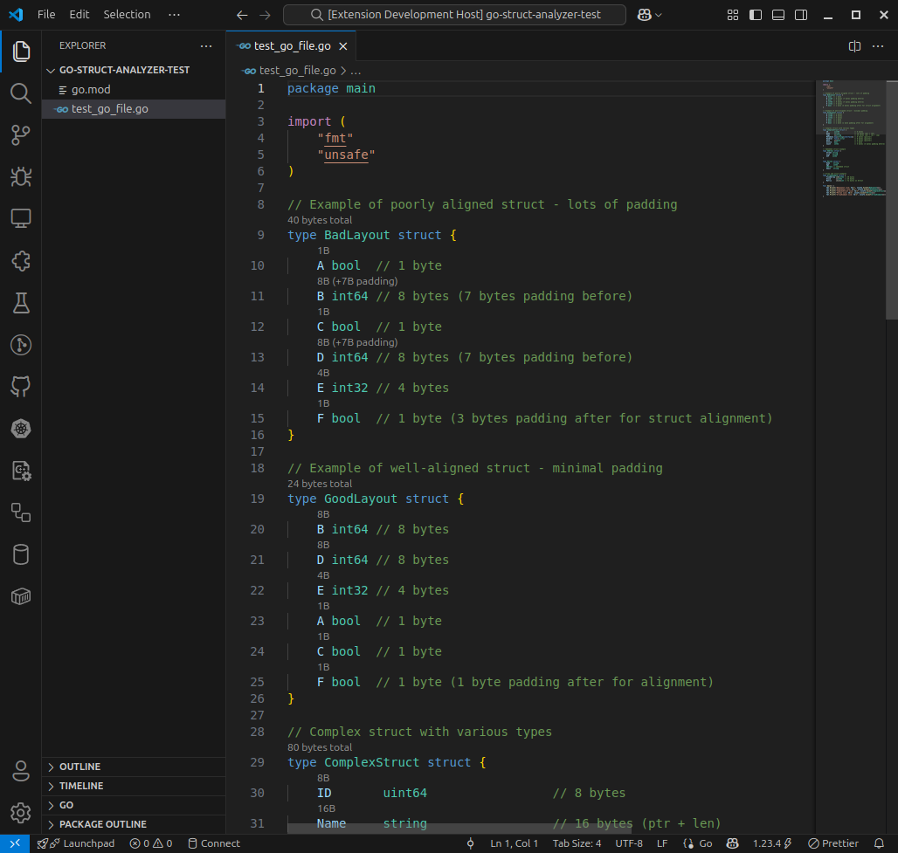

# Go Struct Analyzer

A VS Code extension that shows memory size and padding information for Go structs, helping you optimize memory usage and understand struct layout.

## Features

- **Hover Information**: Hover over struct fields to see size, alignment, offset, and padding details
- **Inline Annotations**: Code lens showing field sizes and padding directly in your editor
- **Memory Layout Visualization**: Detailed struct memory layout with visual padding representation
- **Struct Optimization Warnings**: Real-time diagnostics highlighting structs that can be optimized
- **Optimization Suggestions**: Shows potential memory savings with optimal field ordering
- **Architecture Support**: Configurable target architecture (amd64, 386, arm64, arm)
- **Command Palette**: Analyze struct layout command for detailed breakdown

## Usage

### Hover Information
Simply hover over any struct field or struct name to see detailed size information:

```go
type User struct {
    ID       uint64    // Shows: 8 bytes, alignment 8, offset 0
    Name     string    // Shows: 16 bytes, alignment 8, offset 8
    Active   bool      // Shows: 1 byte, alignment 1, offset 24 (+7 padding)
}
```

### Inline Annotations & Optimization Suggestions
Enable inline annotations to see size information and optimization opportunities directly in your code:

```go
type User struct {      // 32 bytes total (can be 25 bytes)
    ID       uint64     // 8B
    Name     string     // 16B
    Active   bool       // 1B (+7B padding)
}
```

When a struct layout can be optimized, the extension shows potential savings in parentheses.

### Memory Layout Analysis
Click on any struct's code lens annotation or use the "Analyze Struct Layout" command (Ctrl+Shift+P) to open a detailed memory layout view showing exact byte positions, padding, and optimization recommendations.


### Optimization Warnings
The extension automatically highlights structs that can be optimized with yellow warning underlines. These warnings appear in the Problems panel and show potential memory savings:

```
⚠️ Struct layout can be optimized: 40 bytes → 25 bytes (saves 15 bytes)
```

## Configuration

Open VS Code settings and search for "Go Struct Analyzer":

- `goStructAnalyzer.showInlineAnnotations`: Show size annotations inline (default: true)
- `goStructAnalyzer.showPadding`: Highlight padding bytes (default: true)  
- `goStructAnalyzer.architecture`: Target architecture for calculations (default: amd64)
- `goStructAnalyzer.enableStructOptimizationWarnings`: Show warnings for structs that can be optimized (default: true)

## Supported Types

### Basic Types
- `bool`, `int8`/`uint8`/`byte`, `int16`/`uint16`
- `int32`/`uint32`/`rune`, `int64`/`uint64`
- `float32`/`float64`, `complex64`/`complex128`
- `int`/`uint`/`uintptr` (architecture-dependent)
- `string`

### Composite Types
- Pointers (`*T`)
- Arrays (`[N]T`)
- Slices (`[]T`)
- Maps (`map[K]V`)
- Channels (`chan T`)
- Interfaces (`interface{}`)
- Functions (`func(...)`)

## Installation

### From Source

1. Clone this repository
2. Run `npm install` to install dependencies
3. Run `npm run compile` to build the extension
4. Press F5 to launch a new VS Code window with the extension loaded

### Building VSIX Package

```bash
npm install -g vsce
vsce package
```

Then install the generated `.vsix` file in VS Code.

## Development

### Project Structure

```
├── src/
│   ├── extension.ts     # Main extension entry point
│   ├── parser.ts        # Go struct parsing logic
│   ├── analyzer.ts      # Size and padding calculations
│   ├── hover.ts         # Hover provider implementation
│   ├── codelens.ts      # Code lens provider for inline annotations
│   └── diagnostics.ts   # Diagnostic provider for optimization warnings
├── package.json         # Extension manifest
├── tsconfig.json        # TypeScript configuration
└── README.md           # This file
```

### Key Components

- **GoStructParser**: Parses Go source code to extract struct definitions and fields
- **StructAnalyzer**: Calculates field sizes, alignments, offsets, padding, and optimal layouts
- **HoverProvider**: Provides detailed information on hover
- **CodeLensProvider**: Shows inline size annotations and optimization suggestions
- **StructDiagnosticsProvider**: Provides real-time optimization warnings

### Architecture Notes

The extension calculates struct layouts based on Go's memory alignment rules:

- Each field is aligned to its natural alignment boundary
- Struct alignment is the largest alignment of any field
- Final struct size is padded to be a multiple of its alignment

Size calculations vary by target architecture:
- **amd64/arm64**: Pointers are 8 bytes, `int`/`uint` are 8 bytes
- **386/arm**: Pointers are 4 bytes, `int`/`uint` are 4 bytes

## Examples

### Memory Layout Optimization

**Before optimization (shows warning):**
```go
type BadLayout struct {  // 40 bytes total (can be 25 bytes) ⚠️
    A bool     // 1B
    B int64    // 8B (+7B padding)
    C bool     // 1B  
    D int64    // 8B (+7B padding)
    E int32    // 4B
    F bool     // 1B (+3B padding)
}
```

**After optimization (no warning):**
```go
type GoodLayout struct { // 25 bytes total
    B int64    // 8B
    D int64    // 8B  
    E int32    // 4B
    A bool     // 1B
    C bool     // 1B
    F bool     // 1B (+1B padding)
}
```

The optimal layout places fields with larger alignment requirements first, minimizing padding.

### Understanding Padding

```go
type Example struct {
    A int8     // 1 byte at offset 0
    // 3 bytes padding here
    B int32    // 4 bytes at offset 4
    C int8     // 1 byte at offset 8
    // 7 bytes padding here  
    D int64    // 8 bytes at offset 16
    // Total: 24 bytes (not 14!)
}
```

## Contributing

1. Fork the repository
2. Create a feature branch
3. Make your changes
4. Add tests if applicable
5. Submit a pull request

## License

MIT License - see LICENSE file for details.

## Changelog

### 1.0.1
- Added struct layout optimization warnings and suggestions
- Real-time diagnostics highlighting non-optimal structs
- Enhanced code lens with optimization hints (e.g., "40 bytes total (can be 32 bytes)")
- Detailed optimization information in memory layout view
- Configuration option to enable/disable optimization warnings
- Improved command functionality with direct struct analysis from code lens clicks
- Fixed bug: Detailed optimization information tab not shown when clicking on codelens annotation,  `No struct found at cursor position` is shown instead.

### 1.0.0
- Initial release
- Basic struct parsing and analysis
- Hover information and code lens support
- Architecture-dependent size calculations